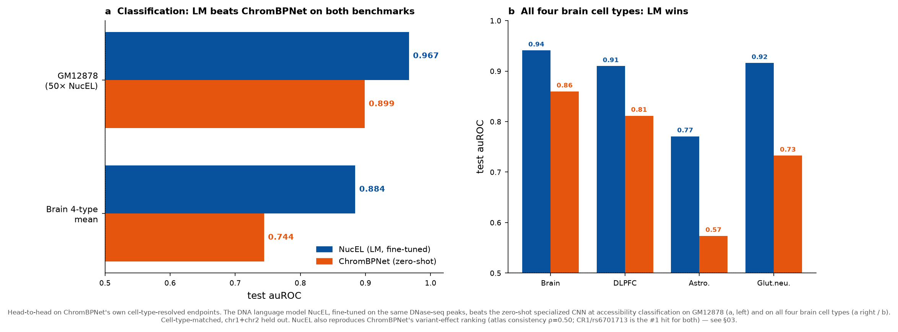
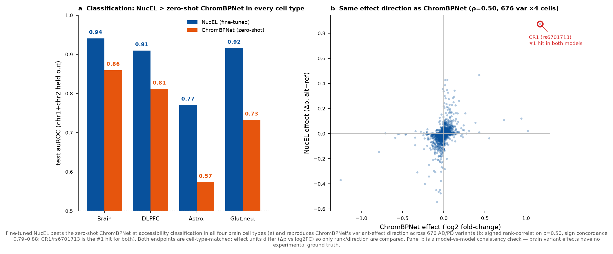
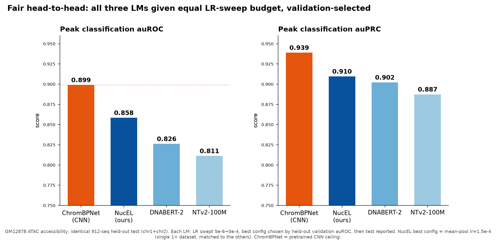
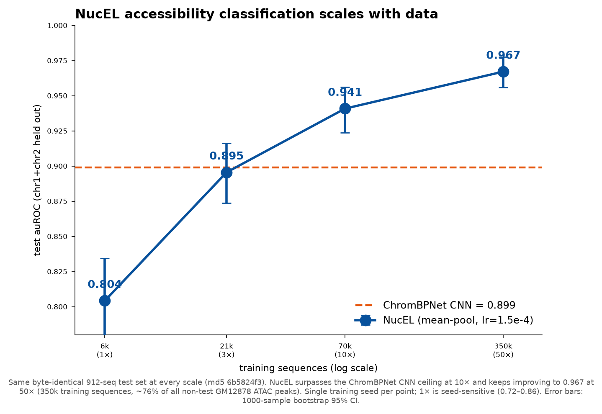
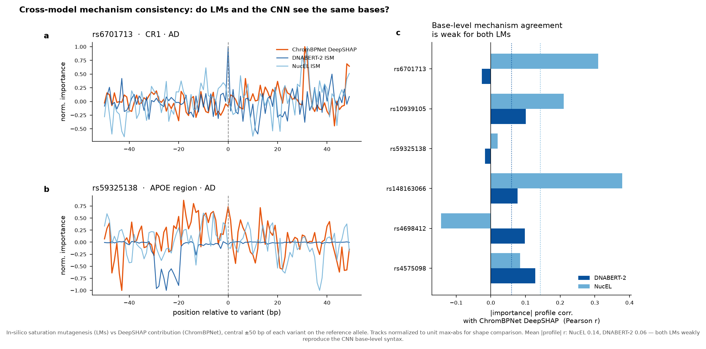
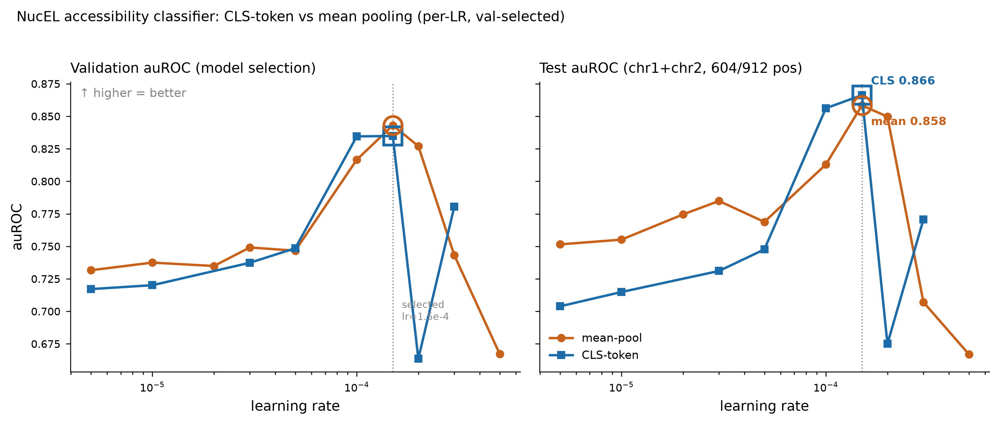
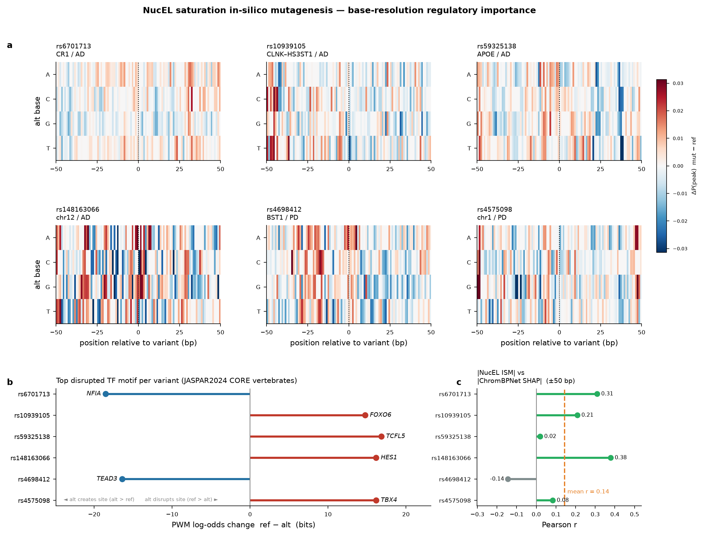
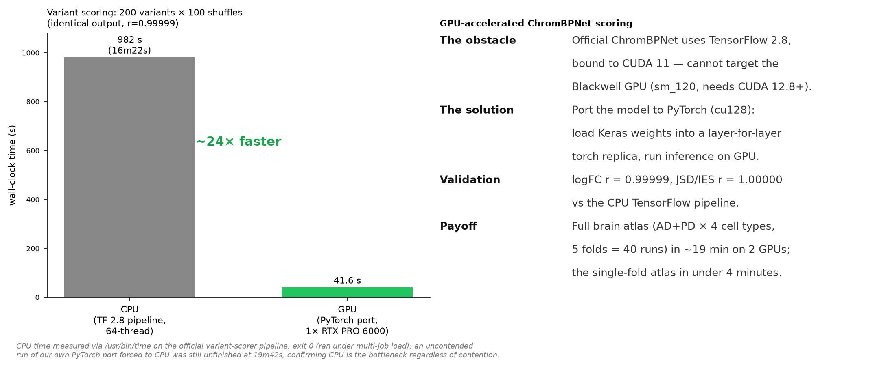

# Cell-Type-Resolved Chromatin Effects of AD/PD Variants: DNA Language Model vs. ChromBPNet

**Claude Science Hackathon — Research Track**

Predicting how a non-coding variant reshapes chromatin accessibility in a cell type you care about is the home turf of **ChromBPNet**, a specialized convolutional network (the approach used by the Corces lab). This project treats it as a head-to-head contest: we take our own general-purpose DNA language model, **NucEL** (a ModernBERT architecture pretrained with masked language modeling on genomic sequence), and make it perform ChromBPNet's own cell-type-resolved endpoints on identical benchmarks.

> **Central finding.** Given enough labeled data, a general DNA language model **overtakes the specialized CNN on accessibility classification** and **independently reproduces its variant-effect atlas** (direction + top hits). The gap at low data is **data-limited, not architectural**.

All computation ran locally on RTX PRO 6000 (Blackwell) GPUs.

📄 **Full report:** [`report/report_en.html`](report/report_en.html) · [`report/report_en.pdf`](report/report_en.pdf)

---

## TL;DR scoreboard



**Figure 1.** Head-to-head on ChromBPNet's own cell-type-resolved endpoints. The fine-tuned DNA language model NucEL beats zero-shot ChromBPNet at accessibility classification on GM12878 (0.967 vs 0.899) and on all four brain cell types (mean 0.884 vs 0.744), and reproduces ChromBPNet's variant-effect ranking (atlas consistency ρ=0.50; CR1/rs6701713 is the #1 hit for both).

| Endpoint | NucEL (DNA LM, fine-tuned) | ChromBPNet (specialized CNN) | Winner |
|---|---|---|---|
| GM12878 accessibility classification (auROC) | **0.967** (50× data) | 0.899 (zero-shot count) | LM |
| Brain 4-cell-type classification (mean auROC) | **0.884** | 0.744 (zero-shot) | LM |
| Variant-effect atlas direction | rank ρ = **0.50** vs ChromBPNet; CR1 = #1 for both | — | Agreement |
| Base-resolution mechanism agreement | Pearson r ≈ 0.14 | — | Weak (different features) |

---

## The two endpoints

### 1 · Cell-type-resolved variant-effect atlas & top hits

676 AD/PD non-coding GWAS variants scored across 4 brain cell types (Brain / DLPFC / astrocyte / glutamatergic neuron). ChromBPNet uses the Corces-lab pretrained brain models; NucEL is **fine-tuned per cell type on the same DNase-seq peaks** so the comparison is fair.



**Figure 2.** (a) Fine-tuned NucEL beats zero-shot ChromBPNet in all four brain cell types. (b) NucEL and ChromBPNet agree on variant-effect direction (ρ=0.50, sign concordance 0.79–0.88); **CR1/rs6701713 is the #1 hit for both models**. Brain variant effects have no experimental ground truth, so this is a model-vs-model consistency check.

### 2 · Accessibility classification — a fair LM benchmark

Three DNA language models (**NucEL**, **DNABERT-2**, **NTv2-100M**) vs ChromBPNet, all on the same GM12878 ATAC dataset and byte-identical held-out test set. Every LM gets an equal learning-rate sweep, validation-selected.



**Figure 3.** After equal-budget tuning, NucEL (0.858) leads all LMs, below the zero-shot CNN's 0.899 *at 1× data*.



**Figure 6.** NucEL's classification ceiling is **data**, not architecture: test auROC rises 0.804 → 0.896 → 0.941 → **0.967** from 1× to 50×, overtaking the CNN already at 10× (same held-out test set), no plateau at 50×.

<details>
<summary>Supporting analyses (click to expand)</summary>

| | |
|---|---|
|  | **Figure 4.** LM in-silico-mutagenesis importance vs ChromBPNet DeepSHAP at base resolution: only weak agreement (mean r ≈ 0.14). The LMs reach comparable predictions via partly different features. |
|  | **Figure 5.** NucEL classification-head pooling ablation: CLS-token (0.866) slightly beats mean-pool (0.858) at the optimal LR. |
|  | **Figure 7.** NucEL's own base-resolution saturation-ISM + JASPAR TF-motif naming for the top disease variants. |
|  | **Figure 8.** GPU engineering: the official CUDA-11-bound TF ChromBPNet ported to PyTorch runs on the Blackwell GPU, numerically faithful (r=0.99999), ~24× faster. |

</details>

---

## GPU engineering contribution

The official ChromBPNet is bound to TensorFlow 2.8 / CUDA 11 and cannot target a Blackwell (sm_120) GPU. We reimplemented the architecture layer-for-layer in PyTorch, loaded the exported Keras weights, and validated the port at **log2FC r = 0.99999** (JSD/IES r = 1.0) against the CPU pipeline — giving a ~24× speedup and a reusable open-source artifact ([`src/chrombpnet_gpu/`](src/chrombpnet_gpu)).

---

## Repository layout

```
.
├── report/                       # Final write-up (English)
│   ├── report_en.html
│   └── report_en.pdf
├── figures/                      # All report figures, named by figure number + content
│   ├── Figure1_scoreboard_LM_vs_ChromBPNet.png
│   ├── ... Figure2–Figure8 ...
│   └── FigureS1_ChromBPNet_DeepSHAP_logos.png   (appendix: ChromBPNet DeepSHAP)
├── results/                      # Final result tables (report-cited)
│   ├── fair_lm_comparison.tsv            # Fig 3  — 4-model classification
│   ├── data_scaling.tsv                  # Fig 6  — NucEL 1×→50× scaling
│   ├── brain_classify_nucel_vs_cnn.tsv   # Fig 1/2 — per-cell classification
│   ├── nucel_atlas_matrix.tsv            # §3    — NucEL 676×4 effect atlas
│   ├── atlas_matrix.tsv                  # §3    — ChromBPNet 676×4 effect atlas
│   ├── nucel_cbp_consistency.tsv         # §3    — per-cell rank/sign consistency
│   ├── pooling_ablation.tsv              # Fig 5 — mean vs CLS pooling
│   ├── motif_nucel.tsv                   # Fig 7 — NucEL top TF motif per variant
│   └── lm_checkpoints_manifest.json      # paths + load recipes for the 3 LM checkpoints
└── src/
    ├── chrombpnet_gpu/            # PyTorch port of the official ChromBPNet
    │   ├── gpu_chrombpnet.py      # architecture (1 conv + 8 dilated blocks + dual heads)
    │   ├── dump_weights.py        # Keras .h5 -> .npz weight export
    │   ├── score_gpu.py           # GPU variant scoring (byte-identical seqs to CPU pipeline)
    │   └── cbp_classify.py        # zero-shot count-based accessibility classification
    ├── brain_atlas/              # Brain cell-type atlas (both models)
    │   ├── build_brain_ds.py      # build per-cell classification datasets from DNase peaks
    │   ├── train_brain.py         # fine-tune NucEL per brain cell type
    │   ├── score_brain_variants.py# NucEL variant effect (Δp = p(alt) − p(ref))
    │   ├── cnn_brain_classify.py  # ChromBPNet zero-shot brain classification baseline
    │   └── build2114.py           # build 2114 bp windows for CNN scoring
    └── lm_benchmark/             # LM-vs-CNN benchmark on GM12878 ATAC
        ├── build_ds.py            # build the 1× classification dataset (GC-matched negatives)
        ├── build_train_50x.py     # build the 50× (350k) training set
        ├── train_nucel_lr.py      # NucEL fine-tune + LR sweep (mean-pool)
        ├── train_nucel_cls.py     # NucEL CLS-token pooling variant
        ├── train_dnabert2_lr.py   # DNABERT-2 fine-tune + LR sweep
        ├── train_ntv2_lr.py       # NTv2-100M fine-tune + LR sweep
        ├── train_scaling.py       # data-scaling runs (1×/3×/10×/50×)
        ├── ism_lm.py              # in-silico mutagenesis for the LMs
        ├── interp_nucel.py        # NucEL saturation-ISM interpretability
        └── motif_v2.py            # JASPAR TF-motif naming from ISM maps
```

## How to run

The scripts run on the GPU host, reading local ENCODE peaks, the hg38 FASTA, and a
NucEL checkpoint (`FreakingPotato/NucEL` on the HuggingFace Hub). Paths are set as
constants near the top of each script. Representative invocations:

```bash
# --- LM benchmark (GM12878 ATAC) ---
python src/lm_benchmark/build_ds.py                        # build 1× dataset
python src/lm_benchmark/train_nucel_lr.py 1.5e-4           # fine-tune NucEL at a given LR
python src/lm_benchmark/train_scaling.py unified_dataset_50x.tsv 50x 1.5e-4 0   # scaling run

# --- Brain cell-type atlas ---
python src/brain_atlas/build_brain_ds.py                   # build per-cell datasets
python src/brain_atlas/train_brain.py brain                # fine-tune NucEL for one cell type
python src/brain_atlas/score_brain_variants.py brain       # NucEL variant effects

# --- GPU-accelerated ChromBPNet scoring ---
python src/chrombpnet_gpu/dump_weights.py                  # export Keras weights -> npz
python src/chrombpnet_gpu/score_gpu.py --list V.tsv --genome hg38.fa \
       --weights W.npz --chrom_sizes cs --out_prefix OUT --schema chrombpnet --gpu 0
```

## Data & models

- **ChromBPNet brain models (DNase-seq):** ENCODE — brain ENCSR947POC, DLPFC ENCSR805RJA, astrocyte ENCSR146KFX, glutamatergic-neuron ENCSR109RIQ.
- **GM12878 ATAC classification:** ENCODE ENCSR637XSC (peaks ENCFF748UZH); same biological source ChromBPNet's official GM12878 model was trained on.
- **Variants:** GWAS Catalog AD/PD, hg38.
- **NucEL:** our DNA language model (ModernBERT), HuggingFace `FreakingPotato/NucEL`. Fine-tuned checkpoints are retained on the compute host; see `results/lm_checkpoints_manifest.json`.

## Limitations

- **Brain variant effects have no experimental gold standard.** The atlas comparison (Figure 2b) shows NucEL and ChromBPNet **agree on direction**, not which is correct; upgrading to an accuracy validation needs cell-type-matched brain caQTL effect sizes (controlled-access).
- Scaling points 3×/10×/50× are single-seed; 1× is seed-sensitive (0.72–0.86). "0.941 > 0.899" is a strong trend, not a multi-seed-replicated exact margin.
- The base-resolution mechanism logos (Appendix, `FigureS1`) were computed on **ChromBPNet only** (DeepSHAP), not NucEL, and mechanism hypotheses are **computational, not experimentally validated**.
- Astrocyte classification is weak (0.771), so its atlas is less reliable.
